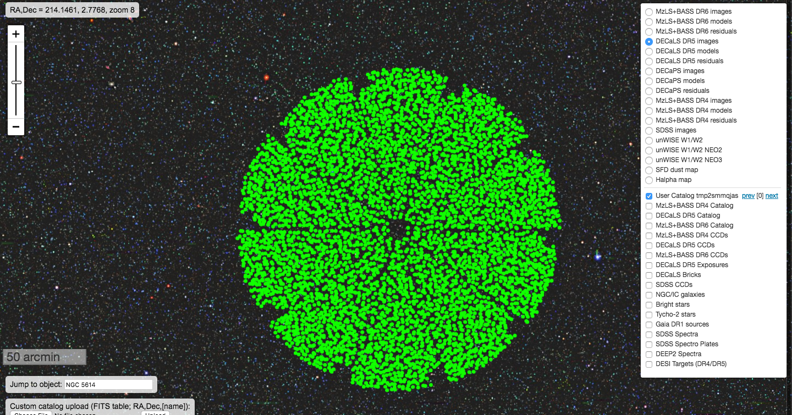

# fiberassign_sv

Running fiberassign on DECaLS data (DR5) on SV pointings using a single python script.

To run the script do the following in a login node on cori@NERSC.

```
source /project/projectdirs/desi/software/desi_environment.sh
```

```
git clone https://github.com/forero/fiberassign_sv
```

```
cd fiberassign_sv
```

```
python main.py
```

`main.py` takes as an input the file `/project/projectdirs/desi/target/catalogs/targets-dr5-0.20.0.fits` to prepare input files for `fiberassign`. The script has to:

* convert the input into a Merged Target List file as an input for `fiberassign`.
* select standard stars.
* create a separate file of sky positions.

The set of input tiles to be fed into `fiberassign` is not the standard DESI footprint. These special tiles are stored under `data/bgs_sv.fits` (a file provided by Kyle Dawson.)

After preparing the inputs the script finally runs `fiberassign`.

You can visualize the outputs from a single pointing (i.e. `output/tile_100015.fits`) using http://legacysurvey.org/viewer/

Final outputs for all tiles can be found here http://portal.nersc.gov/project/desi/users/forero/SV_BGS_v0.1/




